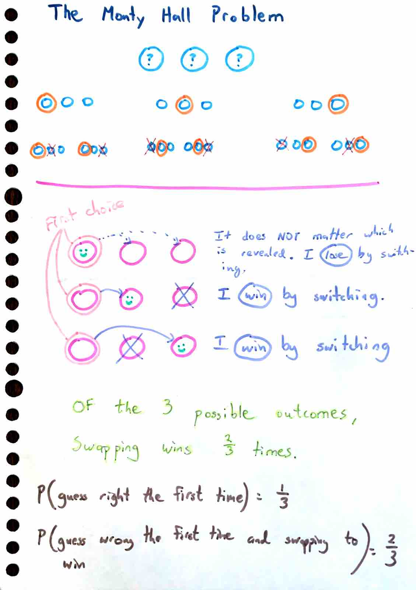

# The Monty Hall problem

[The Monty Hall problem](https://www.google.com/search?q=monty+hall+problem) is
a popular thought experiment that exemplifies (in my view) the "strangeness" of
statistics and conditional probability.

After reading
[Steven Pinker's recent book, Rationality,](https://www.google.com/search?q=steven+pinker+rationality)
I finally understand why the probability of winning if you swap is `2/3`, not `1/2`.

The [code itself](./montyHall.ts) demonstrates how it became clear to me.

If you run the code, you will see a result like this:

```ts
// Swapping will win ~66% of the time.
{
  numWinsByStrategyConcise: { stay: 332538, swap: 667462 },
  numWinsByStrategyVerbose: { stay: 334535, swap: 665465 }
}
```


